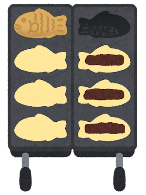
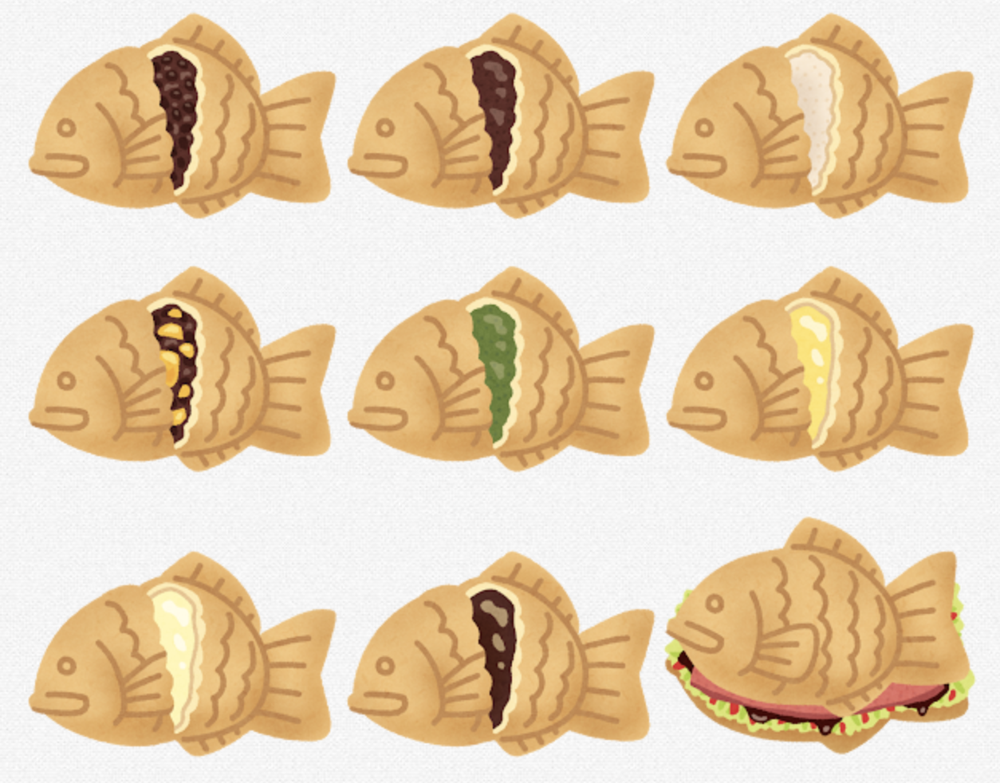
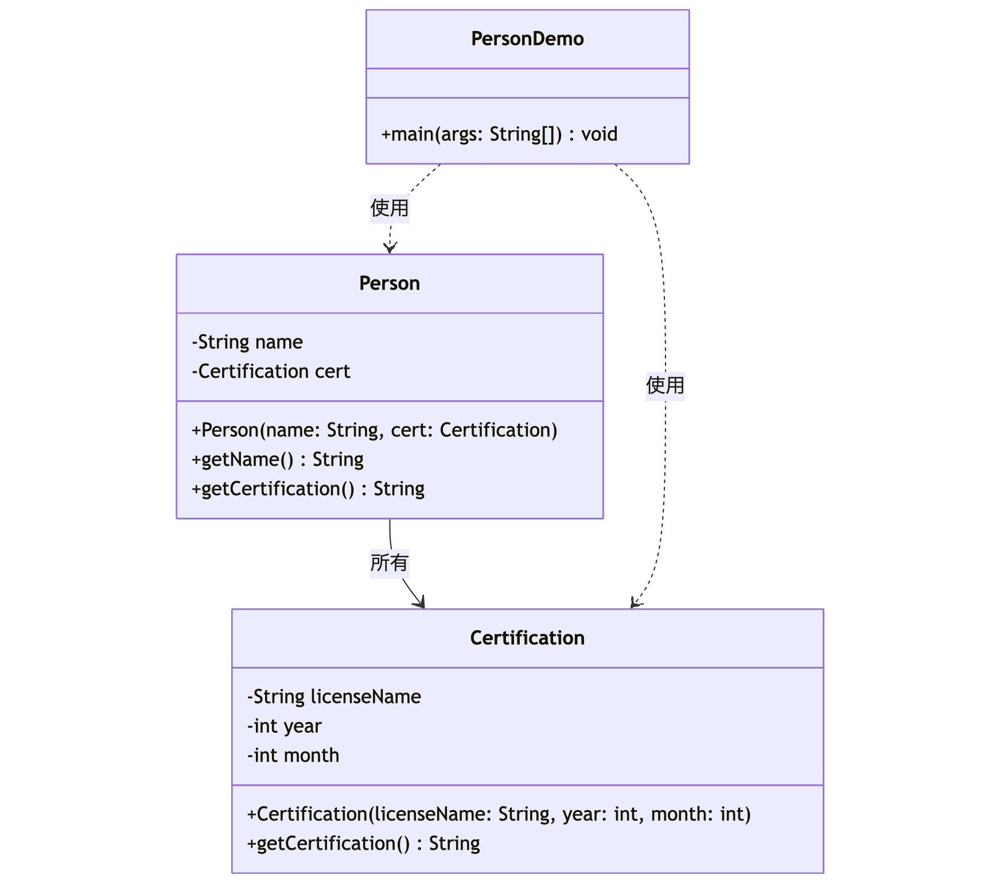

---
# You can also start simply with 'default'
theme: seriph
# random image from a curated Unsplash collection by Anthony
# like them? see https://unsplash.com/collections/94734566/slidev
background: https://cover.sli.dev
# some information about your slides (markdown enabled)
title: Welcome to Slidev!
info: |
  ## Slidev Starter Template
  Presentation slides for developers.

  Learn more at [Sli.dev](https://sli.dev)
# apply unocss classes to the current slide
class: text-center
# https://sli.dev/features/drawing
drawings:
  persist: false
# slide transition: https://sli.dev/guide/animations.html#slide-transitions
transition: slide-left
# enable MDC Syntax: https://sli.dev/features/mdc
mdc: true
# open graph
# seoMeta:
#  ogImage: https://cover.sli.dev
---

# クラス と インスタンスの基本

<div @click="$slidev.nav.next" class="mt-12 py-1" hover:bg="white op-10">
  廣瀬　誠（ひろせまこと） <carbon:arrow-right />
</div>

<div class="abs-br m-6 text-xl">
  <button @click="$slidev.nav.openInEditor()" title="Open in Editor" class="slidev-icon-btn">
    <carbon:edit />
  </button>
  <a href="https://github.com/slidevjs/slidev" target="_blank" class="slidev-icon-btn">
    <carbon:logo-github />
  </a>
</div>

<!--
The last comment block of each slide will be treated as slide notes. It will be visible and editable in Presenter Mode along with the slide. [Read more in the docs](https://sli.dev/guide/syntax.html#notes)
-->

<style>
h1 {
  background-color: #2B90B6;
  background-image: linear-gradient(45deg, #4EC5D4 10%, #146b8c 20%);
  background-size: 100%;
  -webkit-background-clip: text;
  -moz-background-clip: text;
  -webkit-text-fill-color: transparent;
  -moz-text-fill-color: transparent;
}
</style>

---
transition: fade-out
---
# クラスとインスタンスの関係

<div class="grid grid-cols-2 gap-4">
<div>

### クラス（設計図）
- たい焼きの金型
- 設計図であり、実体ではない
- 共通の特徴を定義

{width="200" height="200"}

</div>
<div>

### インスタンス（実体）
- 焼き上がったたい焼き
- クラスから生成された実体
- それぞれが独立した状態を持つ

{width="280" height="280"}

</div>
</div>

---
transition: fade-out
---

<div class="grid grid-cols-2 gap-4">
<div>

```java
// クラス（金型）
class Taiyaki {
    String  anko;        // あんこの種類
    boolean isYakiagari; // 焼き上がり状態
    
    // コンストラクタ（金型に入れる）
    Taiyaki(String anko) {
        this.anko        = anko;
        this.isYakiagari = false;
    }
    
    // メソッド（焼く）
    void yaku() {
        this.isYakiagari = true;
    }
}

// インスタンス生成（たいやきを焼く）
Taiyaki taiyaki1 = new Taiyaki("つぶあん");
Taiyaki taiyaki2 = new Taiyaki("しろあん");
taiyaki1.yaku();  // 焼く
taiyaki2.yaku();  // 焼く
```

</div>
<div>

{width="320" height="320"}
{width="320" height="320"}
</div>
</div>

---
transition: fade-out
---

# クラスとは

<div class="grid grid-cols-2 gap-4">
<div>

- **オブジェクトの設計図**
  <div class="text-sm">

  - 現実世界のモノや概念をモデル化
  - クラスは「型」、インスタンスは「実体」
  - 例: `Person` クラスから「山田花子」インスタンスを生成

  </div>

- **データ（フィールド）の定義**
  <div class="text-sm">
  
  - オブジェクトの状態を保持
  - カプセル化して外部からの直接アクセスを制限
  - 例: `name`（名前）、`age`（年齢）など
  </div>

- **振る舞い（メソッド）の定義**
  <div class="text-sm">

  - オブジェクトが実行できる操作
  - データに対する処理をカプセル化
  - 例: `getName()`（名前取得）、`setName()`（名前設定）
  </div>


</div>
<div>

- **コンストラクタ**
  <div class="text-sm">

  - オブジェクト生成時の初期化処理
  - インスタンスの初期状態を設定
  </div>

- **カプセル化**
  <div class="text-sm">

  - データとそれを操作するメソッドを1つにまとめる
  - 内部実装の詳細を隠蔽
  </div>
{width="200" height="200"}

</div>
</div>

---
transition: fade-out
---

<div class="grid grid-cols-2 gap-4">
<div>

```java
// Personクラスの例
public class Person {
  // フィールド（データ）
  private String name;  // 名前
  private int    age;   // 年齢

  // コンストラクタ（構築子）
  // インスタンス（実体）生成時に自動的に呼ばれる特別なメソッド
  public Person(String name, int age) {
    this.name = name;
    this.age  = age;
  }

  // メソッド（振る舞い）
  // 名前を取得する（ゲッター）
  public String getName() { return this.name; }

  // 名前を設定する（セッター）
  public void setName(String name) { this.name = name; }

  // 自己紹介する
  public void introduce() { 
    System.out.println(this.name + this.age + "歳です。"); 
  }
}
```

</div>
<div>

```java
// インスタンス生成（実体）
Person hanako = new Person("山田花子", 22); 
Person taro   = new Person("田中太郎", 22); 

// 自己紹介する
hanako.introduce();
taro.introduce();
```

{width="240" height="240"}

</div>
</div>


<!-- Read more about [Why Slidev?](https://sli.dev/guide/why) -->

<!--
You can have `style` tag in markdown to override the style for the current page.
Learn more: https://sli.dev/features/slide-scope-style
-->

<style>
h1 {
  background-color: #2B90B6;
  background-image: linear-gradient(45deg, #4EC5D4 10%, #146b8c 20%);
  background-size: 100%;
  -webkit-background-clip: text;
  -moz-background-clip: text;
  -webkit-text-fill-color: transparent;
  -moz-text-fill-color: transparent;
}
</style>

<!--
Here is another comment.
-->

---
transition: fade-out
---

# 設計方針

<div class="grid grid-cols-2 gap-4">
<div class="text-sm">

##### 1. 資格情報の作成
- **基本情報技術者** の資格情報を作成
- **応用情報技術者** の資格情報を作成
<br>
<br>

##### 2. 人物情報の作成と資格の関連付け
<ul style="list-style: none; padding: 0; margin: 0;">
  <li style="margin: 0; padding: 0; line-height: 1.25;"><strong>日立太郎</strong> さんを作成</li>
  <li style="margin: 0; padding-left: 1rem; line-height: 1.25; list-style: none;">名前: 日立太郎</li>
  <li style="margin: 0; padding-left: 1rem; line-height: 1.25; list-style: none;">関連付ける資格: 基本情報技術者</li>
</ul>
<br>
<ul style="list-style: none; padding: 0; margin: 0;">
  <li style="margin: 0; padding: 0; line-height: 1.25;"><strong>日立花子</strong> さんを作成</li>
  <li style="margin: 0; padding-left: 1rem; line-height: 1.25; list-style: none;">名前: 日立花子</li>
  <li style="margin: 0; padding-left: 1rem; line-height: 1.25; list-style: none;">関連付ける資格: 応用情報技術者</li>
</ul>
<br>

##### 3. 情報の表示
- 日立太郎さんの情報を表示する
- 日立花子さんの情報を表示する

</div>

<div>

{width="640"}

</div>

</div>

---
transition: fade-out
---

# 実装例

```java
// PersonクラスとCertificationクラスの動作を確認するデモクラス
public class PersonDemo {
  public static void main(String[] args) {
    // 基本情報技術者の資格情報を作成
    Certification fe = new Certification("基本情報技術者", 2019, 6);
    // 太郎さん（基本情報保持）を作成
    Person taro      = new Person("日立太郎", fe);

    // 応用情報技術者の資格情報を作成
    Certification ap = new Certification("応用情報技術者", 2020, 6);
    // 花子さん（応用情報保持）を作成
    Person hanako    = new Person("日立花子", ap);

    // 各人物の名前と資格情報を表示
    System.out.println(taro.getName());            // 太郎の名前を表示
    System.out.println(taro.getCertification());   // 太郎の資格情報を表示
    System.out.println(hanako.getName());          // 花子の名前を表示
    System.out.println(hanako.getCertification()); // 花子の資格情報を表示
  }
}
```

---
transition: fade-out
---

<div class="grid grid-cols-2 gap-4">
<div>

```java
// 人物情報を表すクラス
public class Person {
  private String        name; // 名前
  private Certification cert; // 資格情報

  // コンストラクタ
  public Person(String name, Certification cert) {
    this.name = name;
    this.cert = cert;
  }

  // 名前を取得する（ゲッター）
  public String getName() {
    return this.name;
  }

  // 資格情報を文字列で取得する
  public String getCertification() {
    return this.cert.getCertification();
  }
}
```

</div>
<div>

```java
// 資格情報を表すクラス
public class Certification {
  private String licenseName; // 資格名
  private int    year;        // 取得年
  private int    month;       // 取得月 (1-12)

  // コンストラクタ
  // monthが1〜12の範囲外の場合は無視される
  public Certification(String licenseName, 
                       int    year, 
                       int    month) {
    if (1 <= month && month <= 12) {
      this.licenseName = licenseName;
      this.year        = year;
      this.month       = month;
    }
  }

  // 資格情報を"資格名:年/月"形式で返す
  public String getCertification() {
    return this.licenseName + ":" + 
           this.year + "/" + 
           this.month;
  }
}
```
</div>
</div>


---
transition: fade-out
---

# 実行結果

<div class="grid grid-cols-3 gap-4">

<div>

```bash
日立太郎
基本情報技術者:2019/6
日立花子
応用情報技術者:2020/6
```

</div>
<div>

{width="240" height="240"}

</div>
<div>

{width="240" height="240"}

</div>

</div>


---
layout: center
class: text-center
---

# ご清聴ありがとうございました

<PoweredBySlidev mt-10 />
